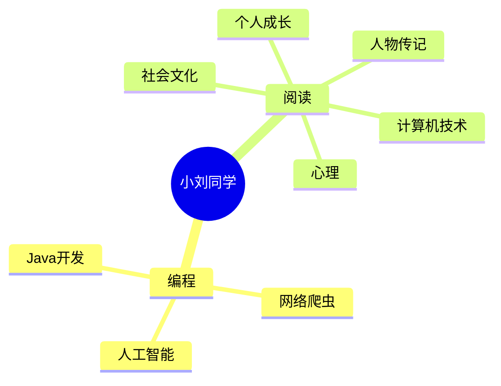

<div align="center">
  
  <!-- dynamic typing effect 动态打字效果 -->
  <div align="center">
    <a href="https://www.apollonai.cn/">
      
    </a>
  </div>

  <!-- knock code pictures 敲代码的图片 -->
  <br>

  <!-- profile logo 个人资料徽标 -->
  <div align="center">
    <a href="https://www.lyzplus.cn/"></a>&emsp;
    <a href="hhttps://space.bilibili.com/133368998/"></a>&emsp;
    <a href="https://blog.csdn.net/lyztyycode"></a>&emsp;
    <!-- visitor statistics logo 访客数统计徽标 -->
    
    <!--   -->
  </div>

  <!-- Snake Code Contribution Map 贪吃蛇代码贡献图 -->
  

</div>

#  🙋 Hello

<table>
<tr><td>

<!-- About me 关于我 -->
### 🤺 About Me
  


<p>&emsp;&emsp;大家好,我是LYZ</p>
<p>&emsp;&emsp;一名Java开发工程师。</p>
<p>&emsp;&emsp;热爱计算机科学和IT互联网事业，励志成为一名资深程序员!</p>
<p>&emsp;&emsp;我们正在让这个世界变得更加美好，通过代码的重复使用和延展构建完美体系。</p>
<p><strong>&emsp;&emsp;We're making the world a better place. Through constructing elegant hierarchies for maximum code reuse and extensibility.</strong></p>
<p>&emsp;&emsp;正在学习云原生技术...</p>

</td></tr>

<tr>
<td>

<!-- 近期博客 -->
### 📃 我的网站
  


<!-- START_SECTION:blog -->
<a href='https://www.lyzplus.cn' target='_blank'>LYZ-ling云智_致力于创建高质量的资源技术共享交流平台</a><br>
<a href='https://chat.lyzplus.cn' target='_blank'>LYZGPT_学术版</a><br>
<a href='https://gpt.lyzplus.cn' target='_blank'>YourGPT</a><br>
<a href='https://shop.lyzplus.cn' target='_blank'>LYZ的杂货铺</a><br>
<a href='https://dlbm.lyzplus.cn' target='_blank'>哆啦B梦_超级导航</a><br>
<a href='https://tool.lyzplus.cn' target='_blank'>LYZ工具站_170+工具集</a><br>

<!-- END_SECTION:blog -->

</td></tr>

<tr><td>

<!--START_SECTION:waka-->
**I'm a Night 🦉** 

```text
🌞 Morning                197 commits         █████░░░░░░░░░░░░░░░░░░░░   18.14 % 
🌆 Daytime                302 commits         ███████░░░░░░░░░░░░░░░░░░   27.81 % 
🌃 Evening                451 commits         ██████████░░░░░░░░░░░░░░░   41.53 % 
🌙 Night                  136 commits         ███░░░░░░░░░░░░░░░░░░░░░░   12.52 % 
```
📅 **I'm Most Productive on Friday** 

```text
Monday                   188 commits         ████░░░░░░░░░░░░░░░░░░░░░   17.31 % 
Tuesday                  143 commits         ███░░░░░░░░░░░░░░░░░░░░░░   13.17 % 
Wednesday                119 commits         ███░░░░░░░░░░░░░░░░░░░░░░   10.96 % 
Thursday                 103 commits         ██░░░░░░░░░░░░░░░░░░░░░░░   09.48 % 
Friday                   295 commits         ███████░░░░░░░░░░░░░░░░░░   27.16 % 
Saturday                 120 commits         ███░░░░░░░░░░░░░░░░░░░░░░   11.05 % 
Sunday                   118 commits         ███░░░░░░░░░░░░░░░░░░░░░░   10.87 % 
```


📊 **This Week I Spent My Time On** 

```text
🕑︎ Time Zone: Asia/Shanghai

💬 Programming Languages: 
Java                   59 mins             ████████████░░░░░░░░░░░░░   49.52 % 
Markdown                 37 mins             ████████░░░░░░░░░░░░░░░░░   31.42 % 
Python                   22 mins             █████░░░░░░░░░░░░░░░░░░░░   18.75 % 
Other                    0 secs              ░░░░░░░░░░░░░░░░░░░░░░░░░   00.31 % 

🔥 Editors: 
Idea                  2 hrs               █████████████████████████   100.00 % 

💻 Operating System: 
Mac                      2 hrs               █████████████████████████   100.00 % 
```


 Last Updated on 02/05/2023 01:24:04 UTC
<!--END_SECTION:waka-->
  
</td></tr>
</table>

<!-- ########################################## 分割 ########################################## -->


<div align="center" >




<!-- just img 图片 -->


<!--  skill badge 技能徽章 -->
💪 正在学习


🧰 常用的工具


<!-- programming tool icon 编程工具图标 -->
<br>

<!-- svg -->


 


<br>

<!-- My Blog 博客首页 -->
&emsp;
<a href="https://www.lyzplus.cn"></a>
&emsp;

</div>

<!-- ########################################## 分割 ########################################## -->


